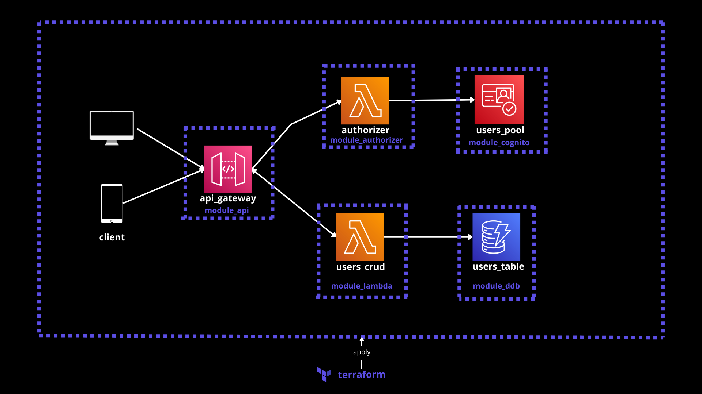
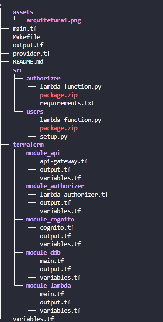

# Projeto autenticação / autorização aws
## Arquitetura implementada

Este projeto implementa uma arquitetura básica de autorização e authenticação aws. Serverless totalmente gerenciada, que pode escalar para milhares de usuários de maneira bem tranquila!

# Como foi organizado o projeto ?

<table style="border: 0" width="100%">
  <tr>
    <td style="border:0; vertical-align: top;" >
      
    </td>
    <td style="border:0; vertical-align: top; text-align: left;">
      Na pasta \`src\` nós temos
    </td>
  </tr>
</table>

